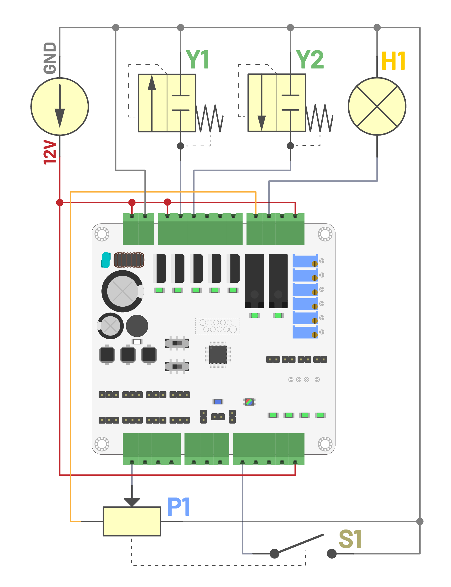

# Sterowanie zaworami proporcjonalnymi w warunkach mobilnych

Emilian **Świtalski**, Krzysztof **Górecki**, Lech **Miedziński**

### Streszczenie

Artykuł przedstawia zagadnienia związane z bezpośrednim sterowaniem zaworami proporcjonalnymi w aplikacjach mobilnych, w szczególności zasilanych napięciem 12 V. Omówiono budowę i charakterystyki zaworów, metody sterowania prądem cewki, sposób kompensacji nieliniowości oraz rolę układów Source/Sink. Zaprezentowano wymagania dla sterownika PLC, porównanie popularnych rozwiązań oraz implementację na otwartym systemie OpenCPLC. Opisano przykład praktyczny — zdalnie sterowaną instalację hydrauliczną w maszynie budowlanej — uwzględniającą modelowanie, nastawy oraz aspekty ergonomii i bezpieczeństwa.

**Słowa kluczowe**: zawory proporcjonalne, hydraulika mobilna, 12V, sterowanie PWM, mosfet driver, source, sink, OpenCPLC, sterownik PLC, automatyka mobilna, dither, impulsy konserwujące, joystick, regulacja przepływu.

## Wstęp

Zawory **elektromagnetyczne** są kluczowymi elementami układów hydrauliki siłowej w maszynach przemysłowych i budowlanych, takich jak koparki, ładowarki, dźwigi czy podnośniki[^1][^2]. Sterują one przepływem oleju hydraulicznego do siłowników i silników, umożliwiając precyzyjne wykonywanie ruchów roboczych, takich jak podnoszenie, przesuwanie czy obracanie. W maszynach o małej i średniej mocy zawory te pełnią rolę podstawowych elementów wykonawczych. Często stosuje się zawory proporcjonalne, które umożliwiają płynną regulację ciśnienia i przepływu, co pozwala na dostosowanie prędkości i siły działania siłowników do aktualnych potrzeb operacyjnych[^3]. Układy sterowania w tych maszynach zasilane są zazwyczaj napięciem **12V**, co wynika z kompatybilności z instalacjami elektrycznymi pojazdów oraz zastosowania akumulatorów o takim napięciu nominalnym.

Należy zauważyć, że w warunkach terenowych napięcie zasilania bywa niestabilne, mogą występować spadki napięcia, zakłócenia od silników, straty na przewodach oraz wahania związane z temperaturą, zużyciem akumulatora czy obciążeniem przetwornic. Dodatkowo, podczas uruchamiania maszyny napięcie w instalacji może gwałtownie wzrosnąć. Po rozpoczęciu pracy alternatora lub przetwornicy napięcie zasilania często przekracza wartość nominalną, osiągając nawet 16V. Te aspekty należy uwzględnić zarówno podczas projektowania i doboru urządzeń do sterowania zaworami hydraulicznymi, jak i później, przy implementacji sterowania i zabezpieczeń.

[^1]: R. Li, Y. Zhang, Z. Feng, J. Xu, X. Wu, M. Liu, Y. Xia, Q. Sun, W. Yuan; **Review of the Progress of Energy Saving of Hydraulic Control Systems**, Processes, 2023, `doi:10.3390/pr11123304`
[^2]: C. Li, X. Liu, X. Wang; **Optimization of Multi-Way Valve Structure in Digital Hydraulic System of Loader**, Energies, 2021, `doi:10.3390/en14030700`
[^3]: S. Ketelsen; **Efficient Actuation of Load Carrying Applications by Electro-Hydraulic Compact Drives**, Aalborg University, 2022, `doi:10.54337/aau488129124`

## Zawory elektromagnetyczne

Zawór elektromagnetyczny to zawór hydrauliczny zintegrowany z odpowiednio dobranym elektromagnesem, co umożliwia jego elektryczne sterowanie. Możemy wyróżnić trzy typy zaworów elektromagnetycznych:

- Zawory **dwupołożeniowe** — mają tylko dwa stany: otwarty _(włączony)_ lub zamknięty _(wyłączony)_. Sterowanie polega na załączeniu lub odłączeniu napięcia do cewki. Po podaniu napięcia iglica _(rdzeń)_ jest przyciągana przez elektromagnes, co otwiera przepływ medium. Po wyłączeniu napięcia zawór wraca do stanu spoczynkowego, najczęściej za pomocą sprężyny. Nie pozwalają na regulację stopnia otwarcia.
- Zawory **proporcjonalne** _(rys. 1)_[^4] — umożliwiają uzyskanie położeń pośrednich iglicy _(rdzenia)_, a więc płynną regulację przepływu lub ciśnienia. Iglica i sprężyna zostały zaprojektowane tak, aby ich wzajemne oddziaływanie mechaniczne umożliwiało równoważenie siły elektromagnesu. Im większy prąd płynie przez cewkę, tym większa siła przyciągająca rdzeń i dalsze przemieszczenie iglicy.
- Zawory z wbudowaną elektroniką sterującą — zawierają zintegrowany układ regulacji, dzięki czemu można je sterować bezpośrednio sygnałem analogowym _(0..10V, 4..20mA)_ lub cyfrowo _(np. Modbus RTU, CAN, IO-Link)_. Wewnętrzna elektronika zamienia sygnał zadany na odpowiedni prąd cewki i dba o liniowość, czas reakcji oraz zabezpieczenia termiczne. Programista/automatyk nie musi już bezpośrednio sterować prądem, wystarczy ustawić wartość zadania. To rozwiązanie znacząco upraszcza aplikację i zwiększa powtarzalność pracy zaworu, choć wiąże się z wyższą ceną.


> **Rysunek 1**. Budowa zaworu dwupołożeniowego oraz proporcjonalnego

Zawory dwupołożeniowe, mimo swojej prostoty i niezawodności, mają ograniczone zastosowanie w nowoczesnych układach hydrauliki siłowej. W maszynach takich jak koparki, ładowarki, dźwigi czy podnośniki, gdzie wymagane jest precyzyjne sterowanie ruchem siłowników lub napędów, zawory typu włącz/wyłącz okazują się niewystarczające. Nie pozwalają na płynną regulację siły, prędkości ani pozycji, co znacznie ogranicza ich funkcjonalność w aplikacjach wymagających dozowania, pozycjonowania lub łagodnego startu i zatrzymania. Z drugiej strony, zawory z wbudowaną elektroniką sterującą, mimo że oferują bardzo wysoką precyzję i często pełną diagnostykę, są rozwiązaniami kosztownymi i nie zawsze łatwo dostępnymi, zarówno pod względem cenowym, jak i logistycznym. Ich wymienność pomiędzy producentami bywa ograniczona, a dostępność części zamiennych w terenie jest niewielka.

Z tego względu zawory proporcjonalne _(bez elektroniki)_ stanowią najpopularniejsze rozwiązanie, mimo że ich implementacja z poziomu aplikacji jest najtrudniejsza. Pozwalają zrealizować płynną regulację. Są szeroko stosowane w praktyce przemysłowej i mobilnej, co dodatkowo obniża ich cenę i zwiększa dostępność. Zawory proporcjonalne są elastyczne i mogą pracować także jako zawory dwupołożeniowe z możliwością realizacji łagodnego startu i zatrzymania. Oddzielenie elementów wykonawczych od sterowania daje swobodę w projektowaniu logiki i doborze parametrów sterowania. W przeciwieństwie do zaworów z wbudowaną elektroniką sterującą, które są fabrycznie zamknięte i trudne do modyfikacji, zawory proporcjonalne pozwalają na większą kontrolę i łatwiejsze dopasowanie w aplikacjach niestandardowych.

[^4]: Danfoss; **Proportional Valves**, https://assets.danfoss.com/documents/latest/370521/BC332375973113en-000201.pdf, 2023

## Sterowanie zaworem proporcjonalnym

Najważniejszym parametrem zaworu proporcjonalnego jest charakterystyka zależności pomiędzy prądem a przemieszczeniem iglicy, czyli siłą generowaną przez elektromagnes[^5]. Zawory tego typu są powszechnie stosowane do regulacji ciśnienia, rozdziału lub ograniczania przepływu, a także w sterowaniu ruchem siłowników hydraulicznych. Zawory proporcjonalne posiadają określone napięcie nominalne, najczęściej 12VDC lub 24VDC, które odpowiada 100% możliwej siły elektromagnesu. Dla zaworu z cewką 12V pierwsze oznaki ruchu iglicy pojawiają się już przy napięciu rzędu ~3–4V, a pełne otwarcie następuje przy około ~7–8V. Przedział ten można określić jako **zakres pracy zaworu**. Powyżej tej wartości dalsze zwiększanie prądu/napięcia nie wpływa już znacząco na przepływ, ponieważ iglica osiąga swoje maksymalne wychylenie. Taki przebieg wynika z właściwości konstrukcyjnych cewki i sprężyny: napięcie progowe inicjuje ruch, a maksymalna siła elektromagnesu uzyskiwana jest jeszcze przed osiągnięciem napięcia nominalnego.

Sterowanie zaworem proporcjonalnym polega na regulacji prądu cewki, który bezpośrednio wpływa na siłę elektromagnesu i pozycję iglicy. Najczęściej stosuje się modulację szerokości impulsu **PWM**, ponieważ jest to prosty i skuteczny sposób generowania kontrolowanego prądu przy minimalnych stratach mocy. PWM pozwala uzyskać płynne sterowanie przy użyciu tanich i energooszczędnych układów wykonawczych, takich jak tranzystory MOSFET, a średnia wartość prądu zależy od wypełnienia impulsów. Alternatywą jest zastosowanie precyzyjnych źródeł prądowych, które wymuszają dokładną wartość prądu niezależnie od zmian napięcia zasilania czy charakterystyki cewki. Układy tego typu zapewniają większą dokładność sterowania, ale są droższe, bardziej rozbudowane i powodują większe nagrzewanie się cewki, co może skracać jej żywotność.

**Sygnałem sterującym _(wejściowym)_** może być standardowy sygnał automatyki, taki jak **0..10V** lub **4..20mA**, choć w niektórych przypadkach stosuje się inne zakresy. Podczas pracy ze sterownikiem PLC, jeśli wartości przekraczają 10V lub 20mA, konieczne może być zastosowanie odpowiednich dzielników napięcia lub przetworników sygnału. Jako źródło sterowania można wykorzystać również potencjometr, najczęściej w formie joysticka. Jest to najprostszy i najczęściej stosowany sposób realizacji płynnej regulacji. W konstrukcjach przemysłowych joysticki często wyposażone są w dodatkowy styk, który zamyka się po wyjściu z **_"strefy martwej"_**, znajdującej się w środkowej części zakresu potencjometru. Styk ten może pełnić funkcję sygnału bezpieczeństwa lub informacyjnego dla operatora. W obrębie strefy martwej potencjometr pracuje normalnie, jednak sterownik nie powinien generować sygnału wyjściowego.

W zakresie pracy wzrost prądu/napięcia powoduje stopniowe zwiększanie przepływu, jednak zależność ta nie jest liniowa. Zwykle na początku zakresu przepływ rośnie szybciej, co utrudnia precyzyjne sterowanie. Dlatego wprowadza się kompensację programową. Aby uzyskać liniową zależność między sygnałem sterującym a rzeczywistym przepływem, stosuje się modelowanie przebiegu wyjściowego z wykorzystaniem:

- funkcji **parabolicznej**,
- funkcji **wykładniczej**,
- **tablicy wartości** i aproksymacji pomiędzy wartościami.

[^5]: P. D. Lucian, R. A. Chihaia, G. Zarnescu; **Proportional Solenoid Valve with Electronic Flow Control**, Electrotehnica Electronica Automatica, 2025, `doi:10.46904/eea.25.73.1.1108001`

### Opcjonalne

Dodatkowo można zastosować sygnał **dither**[^6], czyli niewielkie oscylacje prądu _(lub wartości PWM)_, które pomagają zredukować wpływ tarcia i histerezy na pracę zaworu. Warto również zaimplementować proste **filtry cyfrowe**, zwiększając ergonomię pracy i chroniąc układ przed nagłymi skokami sygnału sterującego, które mogą wynikać np. z błędów operatora.

Dobrą praktyką jest wymuszanie **prądu spoczynkowego**[^7], gdy zawór nie jest używany, ale ma być gotowy do natychmiastowego działania. Jego wartość powinna być na poziomie na poziomie 20–50% wartości aktywacyjnej. Dzięki temu zawór nie wykonuje ruchu, ale rdzeń pozostaje w lekkim naprężeniu, co zapobiega jego zablokowaniu i pozwala na szybszą reakcję przy ponownym wysterowaniu. Jest to rozwiązanie powszechnie stosowane, np. gdy operator chwilowo nie używa funkcji podnoszenia, ale układ musi być stale gotowy do pracy. Wyjście z trybu oczekiwania i zakończenie generowania prądu spoczynkowego może być wywołane automatycznie, po określonym czasie bezczynności, lub na podstawie detekcji obecności operatora. Przykładowo można wykorzystać sygnał z czujnika wagi, który zmienia wartość w zależności od tego, czy operator znajduje się na platformie roboczej, czy nie.

W sytuacjach, gdy maszyna lub instalacja pozostaje długo pod zasilaniem, ale zawór używany jest rzadko, warto zastosować **impulsy konserwujące**[^7]. Dotyczy to np. zaworów awaryjnych, siłowników teleskopowych wysuwanych tylko przy określonych manewrach czy dodatkowych funkcji hydraulicznych, z których operator korzysta sporadycznie. Impuls konserwujący powinien trwać od 10–200ms, mieć amplitudę 20–70% prądu aktywacyjnego i być generowany co 30s–1h, w zależności od typu zaworu i warunków pracy.

[^6]: O. Reinertz; **A Comparative Study on Dither Signals and Their Parameterisation**, RWTH Aachen University, 2018, `doi:10.18154/RWTH-2018-224790`
[^7]: Q. Yang, G. Wu, S. Zhang; **Proportional Solenoid Valve with Electronic Flow Control**, International Journal of Automotive Technology, 2024, `doi:10.1007/s12239-024-00053-3`

### Nastawy

Aby użytkownik mógł swobodnie dostosować działanie funkcji sterującej do konkretnego zaworu oraz warunków jego zużycia, aplikacja powinna udostępniać następujące parametry _(rys. 3)_:

- `start` — wartość `x` określająca szerokość strefy martwej sygnału sterującego,
- `min` — wartość aktywacyjna `y`, od której zawór zaczyna się otwierać,
- `end` — wartość `x` określająca moment całkowitego otwarcia zaworu,
- `max` — wartość końcowa `y`, przy której zawór osiąga pełne otwarcie,
- `ramp` — parametr kształtujący krzywiznę funkcji (np. parabolicznej lub wykładniczej).

Warto również zapewnić dodatkowe parametry, które poprawiają ergonomię obsługi oraz wydłużają żywotność zaworów:

- `dither` — amplituda oscylacji sygnału _(redukuje tarcie i histerezę)_,
- `max_delta` — maksymalny dozwolony skok sygnału sterującego _(filtr antyszarpnięciowy)_,
- `alpha_shift` — siła wygładzania filtru EMA,
- `rest` — wartość prądu spoczynkowego _(utrzymanie gotowości zaworu)_,
- `idle_time` — czas po, którym prąd spoczynkowy nie jest generowany,
- `preserv`:
  - `value` — amplituda impulsu konserwującego,
  - `during` — czas trwania impulsu konserwującego,
  - `interval` — odstęp czasu pomiędzy impulsami konserwującymi.


> **Rysunek 2**. Poglądowa charakterystyka zaworu wraz z nastawami

## Układ wykonawczy

W systemach automatyki przemysłowej spotykane są dwa główne sposoby realizacji połączeń sygnałów cyfrowych: układy typu **Source** i układy typu **Sink**[^8]. W konfiguracji typu Source, sygnał sterujący jest dostarczany przez sterownik, który podaje napięcie `12V`/`24V` na wyjściu — prąd przepływa wtedy przez obciążenie do wspólnej masy `GND`. W praktyce takie wyjścia realizuje się z użyciem tranzystorów **PNP** lub MOSFET'ów typu **P** _(rys 3a)_. Z kolei w konfiguracji typu Sink, napięcie zasilające jest podawane na stałe z zewnętrznego źródła, a sterownik _"zamyka"_ obwód do masy poprzez wyjście, prąd przepływa w kierunku sterownika. Układy tego typu bazują na tranzystorach **NPN** lub MOSFET'ach typu **N** _(rys 3b, 3c)_.

Każda z tych metod ma swoje zalety. Układy Source są wygodne instalacyjnie, dzięki wspólnej masie urządzeń upraszczają połączenia, co zmniejsza liczbę przewodów i ułatwia diagnostykę. Ma to szczególne znaczenie w maszynach mobilnych i budowlanych, gdzie potencjał GND często jest połączony z ramą pojazdu lub obudową maszyny. Z drugiej strony, układy Sink są korzystniejsze z punktu widzenia konstrukcji elektroniki, tranzystory typu N są tańsze, szybsze i bardziej wydajne, dlatego są preferowane w projektowaniu nowoczesnych sterowników i modułów. Dla niskich prądów wystarczy prosty MOSFET typu N z rezystorem i diodą zabezpieczającą, a dla większych łatwo dostępne są gotowe drivery.


> **Rysunek 3**. Układy wykonawcze wykorzystujące wyjścia typu Source z tranzystorem MOSFET typu P 🅰 oraz Sink z tranzystorem MOSFET typu N _(dla wysokich 🅱, jak i niskich niskich 🅲 prądów)_

W Europie dominującym standardem są wyjścia typu Source. Takie rozwiązania są uznawane za bezpieczniejsze i bardziej kompatybilne z większością dostępnych czujników i modułów I/O. W Ameryce Północnej oraz w Azji częściej spotyka się instalacje oparte na układach Sink, choć obecnie granice te coraz bardziej się zacierają, a wiele urządzeń oferuje konfigurowalne tryby pracy lub wersje dopasowane do obu standardów.

[^8]: T. Ivaniš, M. Kovačić, M. Makar, Ž. Jakopović; **Advanced gate driving concepts and switching optimization for SiC semiconductors**, Automatika, 65:3, 1300-1314, 2024, `doi:10.1080/00051144.2024.2362525`

## Urządzenie sterujące

Wymagania projektowe dla układu sterowania zaworem proporcjonalnym w zastosowaniu mobilnym _(np. maszyna budowlana)_ są stosunkowo wysokie. Sterownik musi spełniać następujące kryteria:

- Zasilanie napięciem 12V DC, zgodne z instalacjami w pojazdach;
- Możliwość pomiaru napięcia zasilania _(ze względu na jego niestabilność)_;
- Obsługa sygnału wejściowego, w którym 12V jest interpretowane jako logiczna 1️⃣;
- Generowanie sygnału PWM o amplitudzie 12V na wyjściu typu Source.

Spośród najpopularniejszych sterowników _(tab. 1)_ jedynie dwa modele spełniają powyższe wymagania: **Allen-Bradley CompactLogix** oraz **Eaton easyE4**. Pomiar napięcia zasilania można zrealizować za pomocą wejścia napięciowego 0..10V z dzielnikem napięcia lub przy użyciu dodatkowego modułu.

> **Tabela 1**. Zestawienie najpopularniejszych sterowników PLC wraz z wybranymi parametrami technicznymi
> _Dane z tabeli należy traktować jako poglądowe. Wiele sterowników oferuje dedykowane moduły rozszerzeń, zarówno wyjściowe, o większej wydajności prądowej, jak i specjalne moduły do obsługi sygnałów 230V. Podane wartości dotyczą standardowych wejść cyfrowych oraz wyjść tranzystorowych._

| Sterownik PLC                          |     Zasilanie | DI `0` |   DI `1` | DI 230V | Typ `TO`       | Prąd `TO` | Pomiar zasilania [V] | Firmware |
| -------------------------------------- | ------------: | -----: | -------: | :-----: | -------------- | :-------: | :------------------: | :------: |
| Siemens S7-1200                        | 20.4–28.8V ❌ |   ≤ 5V | ≥ 15V ❌ |   ❌    | ✅ Source      |   0.5A    |          ❌          |    ✅    |
| Siemens S7-1500                        | 19.2–28.8V ❌ |   ≤ 5V | ≥ 15V ❌ |   ❌    | ✅ Source/Sink |   0.5A    |          ❌          |    ✅    |
| Mitsubishi MELSEC iQ-F _(FX5U)_        |    ~20–28V ❌ |   ≤ 5V | ≥ 15V ❌ |   ❌    | ✅ Source/Sink |   0.5A    |          ❌          |    ✅    |
| Beckhoff CX7000 _(Embedded-PC)_        | 20.4–28.8V ❌ |   ≤ 5V | ≥ 11V ✅ |   ❌    | ✅ Source      |   0.5A    |          ❌          |    ❌    |
| WAGO PFC200 _(750-8212)_               |   18–31.2V ❌ |   ≤ 5V | ≥ 15V ❌ |   ❌    | ✅ Sink/Source |   0.5A    |          ❌          |    ❌    |
| Allen-Bradley CompactLogix _(1769-Lx)_ |   10–28.8V ✅ |   ≤ 5V | ≥ 11V ✅ |   ❌    | ✅ Source      |   0.5A    |          ❌          |    ✅    |
| Schneider Modicon M221                 | 20.4–28.8V ❌ |   ≤ 5V | ≥ 15V ❌ |   ❌    | ✅ Source      |   0.5A    |          ❌          |    ✅    |
| Phoenix Contact AXC F 2152             |   19.2–30V ❌ |   ≤ 5V | ≥ 11V ✅ |   ❌    | ✅ Sink/Source |   0.5A    |          ❌          |    ❌    |
| B&R X20                                | 20.4–28.8V ❌ |  ≤ 5 V | ≥ 15V ❌ |   ❌    | ❌ Sink        |   0.5A    |          ❌          |    ✅    |
| Delta DVP-SS2                          | 20.4–28.8V ❌ |  ≤ 5 V | ≥ 15V ❌ |   ❌    | ✅ Sink/Source |   0.5A    |          ❌          |    ✅    |
| Eaton easyE4                           | 12.2–28.8V ✅ |  ≤ 5 V |  ≥ 9V ✅ |   ❌    | ✅ Sink/Source |   0.5A    |          ❌          |    ✅    |
| ABB AC500 _(PM573)_                    |     20–30V ❌ |  ≤ 5 V | ≥ 15V ❌ |   ❌    | ✅ Sink/Source |   0.5A    |          ❌          |    ✅    |
| Bosch Rexroth IndraLogic               |     18–30V ❌ |  ≤ 5 V | ≥ 15V ❌ |   ❌    | ✅ Sink/Source |   0.5A    |          ❌          |    ✅    |
| Unitronics UniStream _(USC-B5-B1)_     | 10.2–28.8V ✅ |  ≤ 5 V | ≥ 15V ❌ |   ❌    | ✅ Sink/Source |   0.5A    |          ❌          |    ✅    |
| Turck TX500 _(TX513-P3CV01)_           |     10–32V ✅ |  ≤ 6 V | ≥ 12V ✅ |   ❌    | ✅ Source      |   0.5A    |          ❌          |    ❌    |
| OpenCPLC                               |      9–32V ✅ |  ≤ 5 V |  ≥ 9V ✅ |   ✅    | ✅ Source      |    3A     |          ✅          |    ✅    |

Optymalnym wyborem wydaje się linia otwartoźródłowych sterowników **OpenCPLC**[^9]. Standardowe wyjścia oferują wysoką wydajność prądową **3A** na kanał, przy czym całkowite obciążenie grupy nie powinno przekraczać 5A. Sterownik wyposażony jest w wewnętrzny pomiar napięcia zasilania, dzięki czemu nie ma potrzeby stosowania dodatkowych modułów ani wykorzystywania wejść analogowych. Sterowniki OpenCPLC sprawdzają się dobrze w warunkach niestabilnego zasilania. Warto dodać, że cały projekt został zaprojektowany właśnie z myślą o tego typu zastosowaniach, dlatego naturalnie jest do nich wyjątkowo dobrze przystosowany.

W firmie **Amar** zastosowano model OpenCPLC **Eco** _(rys. 4)_, jednak przykładowa aplikacja przedstawiona w niniejszym opracowaniu może zostać uruchomiona na dowolnym sterowniku OpenCPLC. Jest to możliwe dzięki warstwowemu podejściu do projektowania oprogramowania oraz niewielkiej liczbie wymaganych peryferiów: 2×`TO`, 1×`AI` i 1×`DI`, które są dostępne we wszystkich modelach.


> **Rysunek 4.** Schemat wyprowadzeń _(pinout)_ sterownika **OpenCPLC Eco**

Jak sama nazwa wskazuje, jest to ekonomiczna wersja sterownika, wyposażona w mikrokontroler `STM32G071RB`, który posiada mniej pamięci i ograniczoną liczbę peryferiów w porównaniu do modelu `STM32G0B1RB`. Jedną z charakterystycznych cech wersji **Eco** jest obecność aż sześciu potencjometrów, które mogą pełnić funkcję wejść do lokalnego ustawiania parametrów. Pozwala to na szybką modyfikację nastaw bez potrzeby użycia komputera, wystarczy zwykły śrubokręt. Rozwiązanie to sprawdza się szczególnie dobrze w warunkach terenowych, gdzie dostęp do komputera może być utrudniony. Znacząco upraszcza to proces kalibracji oraz późniejszej regulacji, np. w przypadku zmiany charakterystyki zaworu z czasem. Dodatkowo z myślą o systemach mobilnych, często opartych na joystickach (potencjometrach), sterownik wyposażono w stabilne wyjście referencyjne **10V**, niezależne od głównego napięcia zasilania. Umożliwia ono bezpośrednie zasilanie potencjometrów bez potrzeby stosowania dodatkowych przetwornic, które byłyby konieczne w systemach z niestabilnym zasilaniem.

[^9]: E. Świtalski, K. Górecki; **Otwarte i warstwowe projektowanie sterowników PLC na przykładzie sterownika do zastosowań edukacyjnych**, Przegląd Elektrotechniczny, 2023, `doi:10.15199/48.2024.10.61`

## Demo

W aplikacji demonstracyjnej _(rys. 5)_ sygnałem sterującym jest napięcie z zakresu **0..10V**, generowane przez potencjometr podłączony między linie 0V i 10V. Dzięki temu pełny zakres obrotu potencjometru odpowiada pełnemu zakresowi wejścia analogowego. Nie można w tym przypadku stosować trybu `RDIV` _(dzielnik napięciowy)_, ponieważ potencjometr podłączony bezpośrednio do szyny zasilania działa jako źródło napięcia, a nie jako dzielnik. Z tego powodu wejście analogowe **`AI1`** musi pracować w trybie **VF** _(wtórnik napięciowy)_, który zapewnia poprawne dopasowanie impedancji i pozwala na prawidłowy odczyt napięcia z potencjometru bez jego zniekształcania.

Pozycja środkowa potencjometru odpowiada napięciu **5V**, co traktowane jest jako punkt neutralny, w którym oba zawory pozostają nieaktywne. Przesunięcie gałki w kierunku niższego napięcia _(np. 4.8V–0V)_ powoduje liniowe wysterowanie pierwszego zaworu **`TO1`** w pełnym zakresie pracy zaworu, natomiast w stronę wyższego napięcia _(np. 5.2V–10V)_ wysterowuje zawór drugi **`TO2`**. Sterowanie działa tylko wtedy, gdy aktywne jest wejście cyfrowe **`DI1`** pełniące funkcję zezwolenia. Może być ono sprzężone z dodatkowym stykiem mechanicznym wbudowanym w joystick, który załącza się dopiero po wyjściu z pozycji neutralnej, zabezpieczając dodatkowo przed przypadkowym wysterowaniem zaworów. Wyjście **`RO1`** jest aktywowane, gdy którykolwiek z zaworów jest aktualnie aktywny i może być wykorzystany w innych częściach systemu.



> **Rysunek 5.** Schemat ideowy przykładu demonstracyjnego sterowania zaworami

Kompletny przykład demonstracyjny sterowania zaworami dostępny jest pod adresem: https://github.com/OpenCPLC/DemoValve. 
Najprostszym sposobem na jego uruchomienie jest skorzystanie z aplikacji **OpenCPLC Wizard**: https://github.com/OpenCPLC/Wizard. Program przygotuje środowiskoW do pracy i będzie można załadować opisany wyżej przykład.

```bash
./wizard -g https://github.com/OpenCPLC/DemoValve # Pobranie projektu
make run # Wgranie programu do sterownika
```

W publikacji prezentowany jest jedynie wątek[^10] sterowania zaworami, obejmujący pobranie sygnałów wejściowych oraz modelowanie i aktywację sygnałów sterujących:

```c
// TODO...
```

[^10]: E. Świtalski, K. Górecki; **System zwalniania wątków VRTS jako alternatywa dla RTOS**, Przegląd Elektrotechniczny, 2023, `DOI: 10.15199/48.2023.09.52`

## Projekt Amar

Projekt polega na adaptacji standardowej koparki do roli zdalnie sterowanego systemu serwisowego, przeznaczonego do czyszczenia i obsługi innych maszyn w warunkach placu budowy oraz podczas prac terenowych. Zmodernizowana konstrukcja umożliwia bezpieczne prowadzenie operacji bez konieczności przebywania operatora w kabinie, co zwiększa elastyczność i bezpieczeństwo pracy w trudnym środowisku. W trakcie pracy operator trzyma nadajnik w rękach, który jest on zasilany bateryjnie. Odbiornik, sterowniki **Eco** oraz pozostałe komponenty systemu znajdują się na maszynie i są zasilane z głównego akumulatora ładowanego przez agregat prądotwórczy. 

W projekcie zastosowano bezprzewodowy system sterowania firmy **Irel**. Centralnym elementem jest ręczny nadajnik _(pad)_ wyposażony w zestaw manipulatorów, którego układ (layout) może być dostosowany do indywidualnych potrzeb klienta, zarówno pod względem liczby i rodzaju elementów sterujących, jak i ich rozmieszczenia. Pad przesyła drogą radiową aktualne stany wszystkich manipulatorów _(joysticków, przełączników itp.)_ do dedykowanego odbiornika zamontowanego na maszynie. Odbiornik przetwarza te dane i generuje odpowiednie sygnały wyjściowe:

- analogowe w standardach automatyki **0..10V** lub **4..20mA** dla manipulatorów typu joystick,
- cyfrowe _(ON/OFF)_ dla przełączników.

Wygenerowane sygnały trafiają do czterech modułów OpenCPLC **Eco** zamontowanych na maszynie. Moduły te wykorzystują dedykowane oprogramowanie _(firmware)_, które miesza sygnały wejściowe i steruje zaworami proporcjonalnymi. Dodatkowo obsługiwane są funkcje bezpieczeństwa. We wszystkich modułach działa ten sam firmware, co upraszcza serwis i umożliwia szybką wymianę w przypadku awarii.

Ze względu na ochronę własności intelektualnej firmy, w publikacji przedstawiono jedynie schemat ideowy zdalnego sterowania zaworami _(rys. 6)_ oraz zdjęcia poglądowe systemu _(rys. 7)_. Sterownik Eco różni się od wersji pokazanej w publikacji, ponieważ był to prototyp w wersji beta.


> **Rysunek 6.** Schemat ideowy instalacji zdalnego sterowania zaworami


> **Rysunek 7.** Zdjęcia: przerobionej koparki 🅰, rozdzielnicy 🅱 oraz layoutu pada 🅲.

## Podsumowanie

Mimo stosunkowo prostej implementacji, opisane w publikacji sterowanie zaworami proporcjonalnymi nie należy do najprostszych zagadnień w automatyce. W praktyce jest ono często realizowane za pomocą dedykowanych modułów wykonawczych, jednak możliwość bezpośredniego sterowania tego typu elementami, a także innymi bardziej wymagającymi układami średniej mocy, bezpośrednio ze sterownika zapewnia większą elastyczność, pozwala uprościć system i zredukować koszty.

Większość dostępnych na rynku sterowników PLC jest przystosowana wyłącznie do zasilania 24V, co ogranicza ich zastosowanie w systemach mobilnych, gdzie standardem jest **12V**. Tymczasem umożliwienie pracy z obydwoma napięciami nie wymaga istotnych zmian w elektronice i nie wpływa znacząco na koszt urządzenia.

Obsługa 12V przynosi realne korzyści: upraszcza integrację z instalacją pojazdu, eliminuje potrzebę stosowania przetwornic i zmniejsza złożoność całego systemu. To niewielki wysiłek po stronie producenta, a duże ułatwienie dla integratora i użytkownika końcowego. Trudno wskazać uzasadnienie, dlaczego kompatybilność z 12V wciąż pozostaje rzadkością w tej klasie urządzeń.